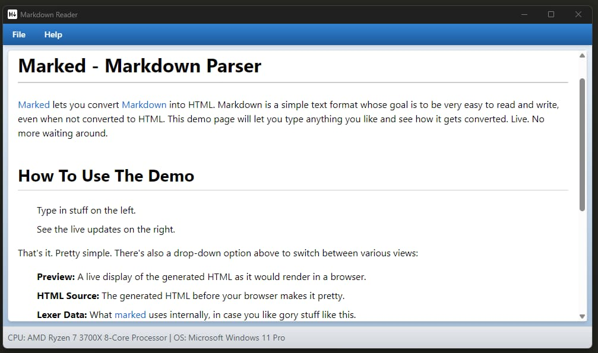

# Simple Markdown Reader

## Description

This is a markdown reader app that allows users to view markdown files. It provides a user-friendly interface for reading and navigating through markdown content.

## Features

- **Markdown rendering**: The app renders markdown files into formatted content, making it easy to read and understand.
- **Navigation**: Users can easily navigate through the markdown file using a table of contents or by scrolling through the content.
- **Syntax highlighting**: The app highlights the syntax of code blocks within the markdown file, improving readability for developers.
- **Customization**: Users can customize the app's appearance and behavior according to their preferences.

## Usage

1. Download the compiled app from the dist folder.
2. Run the app on your local machine.
3. Open a markdown file using the app.
4. Read and navigate through the markdown content.

## Development

To run the app locally:

1. Clone the repository: `git clone https://github.com/your-repo.git`
2. Install dependencies: `npm install`
3. Start the app: `npx neu run`

Feel free to modify the code and request a pull request if you have any improvements or suggestions.

## Contributing

Contributions are welcome! If you have any suggestions or improvements, please submit a pull request.

## License

This project is licensed under the [MIT License](LICENSE).

## TODO

- [ ] Add the dropped files to the recent files list
- [ ] Add a search feature to search for text within the markdown content
- [ ] Implement a dark mode theme for the app
- [ ] Add support for rendering images and other media content in the markdown file
- [ ] Review the compiled files for the different platforms
